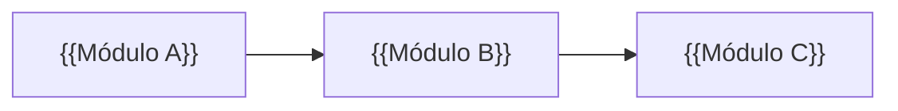
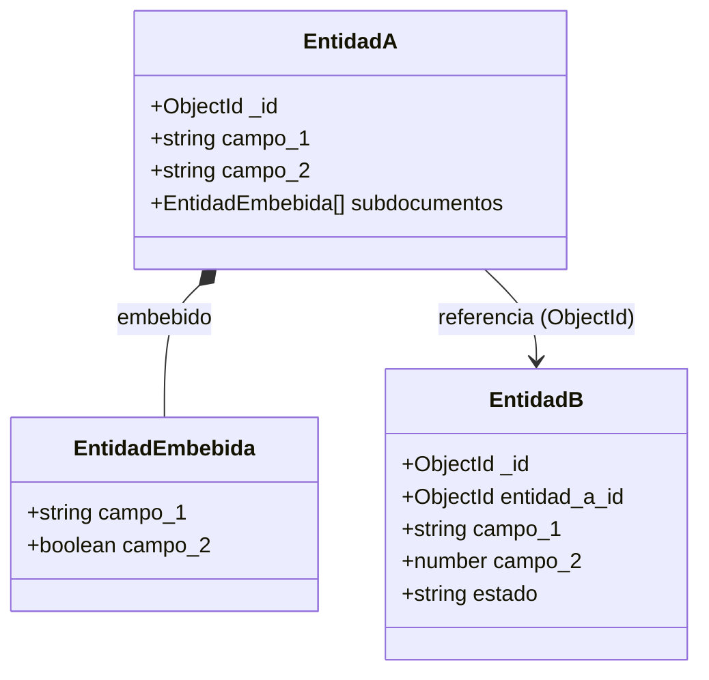

# {{Nombre del Proyecto}} — Modelo de Datos (Diagrama de Clases)

> Base de datos no relacional.

---

## Convenciones

| Notación   | Significado                                                        |
| ---------- | ------------------------------------------------------------------ |
| `*--`      | Composición — el documento hijo **vive embebido** dentro del padre |
| `-->`      | Referencia — se guarda el **ID** del documento referenciado        |
| `+`        | Campo público                                                      |
| `ObjectId` | Identificador único del documento (generado por el motor)          |

---

## Visión General

> Diagrama opcional. Muestra las dependencias entre módulos del proyecto, no colecciones individuales.



---

## Módulo: {{Nombre del Módulo}}

> Breve descripción del módulo y su propósito en el sistema.

### Diagrama



### Colección: EntidadA

| Campo         | Tipo              | Requerido | Descripción            | Validación |
| ------------- | ----------------- | --------- | ---------------------- | ---------- |
| \_id          | ObjectId          | AUTO      | Identificador único    | Generado   |
| campo_1       | String            | SÍ        | Descripción breve      |            |
| campo_2       | String            | NO        | Descripción breve      |            |
| subdocumentos | EntidadEmbebida[] | NO        | Array de subdocumentos |            |

#### Subdocumento: EntidadEmbebida

| Campo   | Tipo    | Requerido | Descripción       | Validación |
| ------- | ------- | --------- | ----------------- | ---------- |
| campo_1 | String  | SÍ        | Descripción breve |            |
| campo_2 | Boolean | NO        | Descripción breve |            |

### Colección: EntidadB

| Campo        | Tipo     | Requerido | Descripción         | Validación |
| ------------ | -------- | --------- | ------------------- | ---------- |
| \_id         | ObjectId | AUTO      | Identificador único | Generado   |
| entidad_a_id | ObjectId | SÍ        | Ref → EntidadA      |            |
| campo_1      | String   | SÍ        | Descripción breve   |            |
| campo_2      | Number   | NO        | Descripción breve   |            |
| estado       | String   | SÍ        | Descripción breve   |            |

> Repetir esta sección `## Módulo: ...` por cada módulo del proyecto.
> Incluir una subsección `### Colección: ...` por cada colección del módulo.
> Agregar subsecciones `#### Subdocumento: ...` para documentos embebidos.
> Agregar notas de negocio (estados, reglas, enums) debajo de la colección que corresponda.

---

## Apéndice

### Campos comunes

> Aplicar a las colecciones que requieran trazabilidad de cambios.

| Campo      | Tipo     | Descripción          |
| ---------- | -------- | -------------------- |
| created_at | DateTime | Fecha de creación    |
| created_by | String   | Usuario creador      |
| updated_at | DateTime | Última modificación  |
| updated_by | String   | Usuario que modificó |

### Índices

```js
// Describir los índices más relevantes del proyecto
// db.entidad_a.createIndex({ campo_1: 1 })
// db.entidad_a.createIndex({ campo_2: 1 }, { unique: true })
```

### Notas de diseño

> Criterios para decidir embebido vs referencia en este proyecto.

- **Embebido**: el subdocumento no tiene identidad propia fuera del padre, o siempre se accede junto al padre.
- **Referencia**: el documento se consulta de forma independiente, o es compartido por múltiples documentos.
