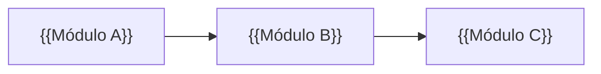
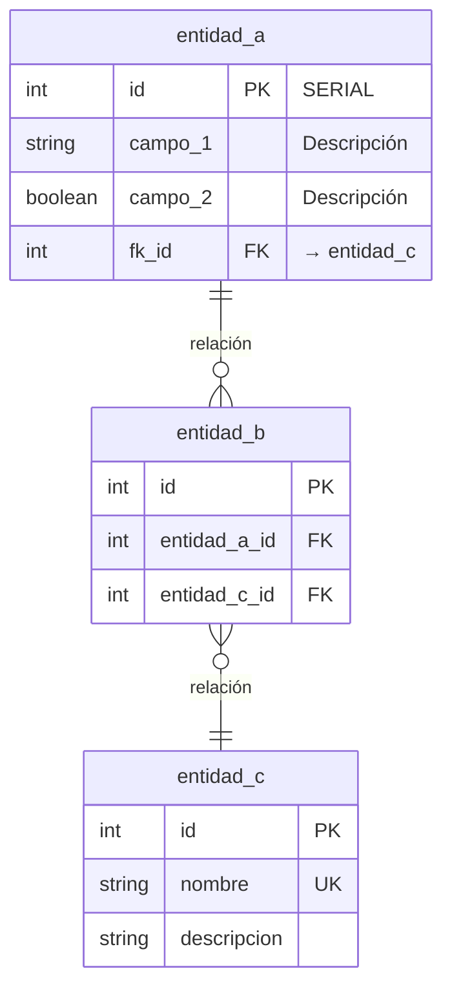

# {{Nombre del Proyecto}} — Modelo de Datos (ERD)

> Base de datos relacional.

---

## Convenciones

| Notación     | Significado                             |
| ------------ | --------------------------------------- |
| PK           | Clave primaria                          |
| FK           | Clave foránea                           |
| UK           | Restricción UNIQUE                      |
| `\|\|--o{`   | Uno a muchos                            |
| `\|\|--\|\|` | Uno a uno                               |
| `}o--o{`     | Muchos a muchos                         |
| SERIAL       | Autoincremental (generado por el motor) |

---

## Visión General

> Diagrama opcional. Muestra las dependencias entre módulos del proyecto, no tablas individuales.



---

## Módulo: {{Nombre del Módulo}}

> Breve descripción del módulo y su propósito en el sistema.

### Diagrama



### Tabla: entidad_a

| Campo   | Tipo | Null | Descripción       | Validación |
| ------- | ---- | ---- | ----------------- | ---------- |
| id      | INT  | NO   | PK                | SERIAL     |
| campo_1 | TEXT | NO   | Descripción breve |            |
| campo_2 | BOOL | NO   | Descripción breve |            |
| fk_id   | INT  | SÍ   | FK → entidad_c    |            |

### Tabla: entidad_c

| Campo       | Tipo | Null | Descripción       | Validación |
| ----------- | ---- | ---- | ----------------- | ---------- |
| id          | INT  | NO   | PK                | SERIAL     |
| nombre      | TEXT | NO   | Nombre            | UNIQUE     |
| descripcion | TEXT | SÍ   | Descripción breve |            |

> Repetir esta sección `## Módulo: ...` por cada módulo del proyecto.
> Incluir una subsección `### Tabla: ...` por cada entidad del módulo.
> Agregar notas de negocio (estados, reglas de transición, enums) debajo de la tabla que corresponda.

---

## Apéndice

### Campos comunes de auditoría

> Aplicar a las tablas que requieran trazabilidad de cambios.

| Campo      | Tipo      | Descripción          |
| ---------- | --------- | -------------------- |
| created_at | TIMESTAMP | Fecha de creación    |
| created_by | TEXT      | Usuario creador      |
| updated_at | TIMESTAMP | Última modificación  |
| updated_by | TEXT      | Usuario que modificó |

### Índices

```sql
-- Describir los índices más relevantes del proyecto
-- CREATE INDEX idx_nombre ON tabla (campo);
```

### Extensiones y notas de motor

```sql
-- Extensiones o configuraciones específicas del motor de base de datos
-- ej PostgreSQL: CREATE EXTENSION IF NOT EXISTS "uuid-ossp";
```
